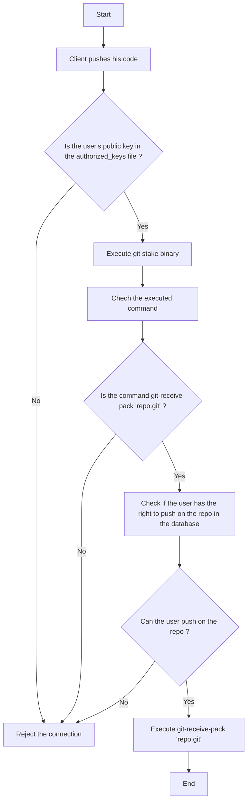

# GitStake - A simple tool to add a layer of authentication to your git server

## Problem

The git protocol has no integrated authentication mechanism. This is not a problem if you have a dedicated server for your git repositories but if you want to host your repositories on a shared server you have to rely on the filesystem to protect your repositories. Managing the filesystem permissions is not very convenient, can be a source of errors and will not work at scale.

Your app might also need to access your app's database. Using the filesystem means that you duplicate the authentication mechanism
when you might just want to use your app's authentication mechanism.

## Solution

GitStake is a simple tool that will allow you to add a layer of authentication to your git server. It will allow you to add an
authentication layer to ssh connections to your git repositories.

## How does it work ?



GitStake is a wrapper around the git-receive-pack command. It will check if the user has the right to push on the repository and if he does it will execute git-receive-pack 'repo.git'. If he doesn't it will reject the connection.

To make sure the script is executed when the ssh connection is made, you need to prefix the public key in the authorized_keys file with the following command followed the a space and the user's public key:

```bash
command="/path/to/gitstake-binary <user_id>" <ssh-key>
```

Where user_id is an integer.

For more information : [OpenSSH Documentation](https://man.openbsd.org/sshd.8#command=_command_)

## How do I test it ?

### Access the project

```bash
git clone git@github.com:paastech-cloud/git-controller.git
cd git-controller/git-auth-layer
```

### Initialize ssh configuration files

This file will initialize two ssh key pairs and an authorized_keys file containing thoses.

```bash
./scripts/init-dev-env.sh
```

### Start the dev environment

This will start 4 containers :

- A container with sshd awaiting connections on port 22 with 2 git repositories
- Two client containers with each one of the ssh key pairs generated with the previous command
- A postgres database

```bash
docker compose up -d
```

### Add the database migrations and data

This will add the migrations to the database

```bash
cd ../..

git clone git@github.com:paastech-cloud/api.git

cd api

yarn

# Edit the DATABASE_URL in the .env file accordingly to the postgres database based on the .env.example file

npx prisma migrate dev

cd ../git-controller/git-auth-layer

docker compose exec -T postgres psql -U paastech -d paastech < data/entrypoint.sql
```

### Connect to the client and test the auth-layer

```bash
docker compose exec client-a bash

cd repos/repoA

echo "$RANDOM" > README.md

git add .

git commit -m "Add README"

# The repository path is the same as the uuid in the entrypoint.sql
git remote add origin git@server:210e364a-3a07-43ba-85b8-2e1c646bd39a.git

git push origin master
```
